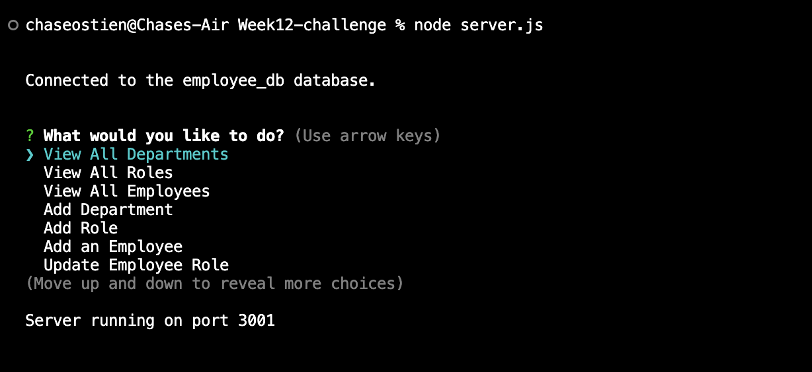

# Content Manager 

## Table of Contents
* [Description](#description)
* [Installation](#installation)
* [Usage](#usage)
* [License](#license)
* [Contributors](#contributors)
* [Tests](#tests)
* [Questions](#questions)

## Description
This command line application will serve as a content management system to allow users to manage a company's employee database. It will prompt the user via command line prompts and utilizes Node.js, Inquirer and MySQl. 
## Installation
To install this application, create a directory in which you will develop your application. Inititalize a `package.json` file by running `npm init -y`. You can then set up your git repo by running `git init` and creating a `.gitignore` file. You will include `node_modules` and `.DS_store` in your `.gitignore` to ensure they are not tracked or uploaded to GitHub. Ensure that your `package.json` file contains all of the required dependencies, including `inquirer: ^8.2.4`, `express: ^4.18.2`, `mysql2: ^3.6.0`, and `console.table: ^0.10.0`. If you wish to store your MySQL user info in a `.env` file, you will need to list the `dotenv: ^10.0.0` dependency in your `package.json` as well. After checking your dependencies, install them by running `npm install` in your root directory. You should see your `node_modules` folder populate in your root directory. Ensure that you can successfully connect to your MySQL database by running a test db query in your JS file.
## Usage
To use this application, make sure you have followed all installation instructions and installed the required dependencies. Log into MySQL and run the `schema.sql` and `seeds.sql` files to create your database. Navigate to the directory containing your main JS file and run it using the command `node (filename).js` that you designated in your `package.json` file. Use the arrow keys to navigate the main menu and choose your desired function. You will be able to view and add departments, roles and employees, along with updating individual employees. 
#### Example of command line prompts for this application.

#### Video recording of program flow and output. 
https://drive.google.com/file/d/1BW7n6Tf6oSjzaciZxBoVMvb3XOzhh7h0/view
## License
ISC License

https://opensource.org/licenses/ISC
## Contributors
This application currently has no contributors other then myself, Chase Ostien.
## Tests
There are currently no written tests for this application, however, you can test its function by running the program and selecting each option displayed in the main menu.
## Credits
This README file was created using a command line README generator developed by myself and hosted at the GitHub repo below.

https://github.com/ChaseOstien/README_Generator

## Questions
### If you have any questions about this application, please send all correspondence to the contact info listed below. 
* GitHub: ChaseOstien - https://github.com/ChaseOstien
* Email: Chaseostien@gmail.com